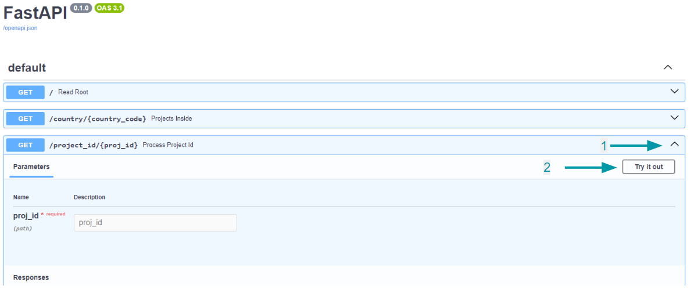
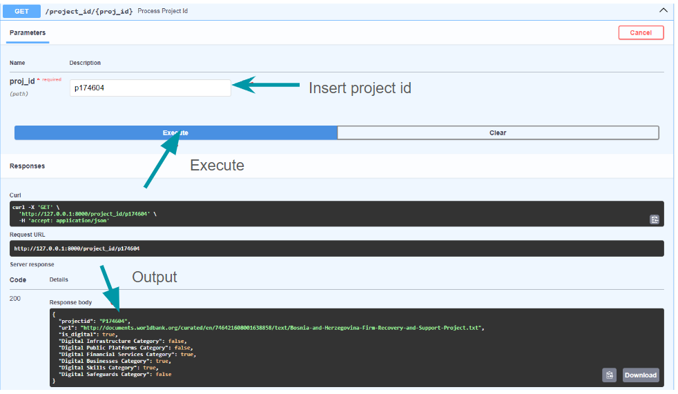

# DigitalPillarAI
We create a bot that classify Project Appraisal Documents from the World Bank into six pillars

## Map


For more information see the following [presentation](https://docs.google.com/presentation/d/1a7K9lNXmaZbPMxGqiXFh50ZLckUDn2EAwRYhos9mQjc/edit#slide=id.g28df624ee2f_0_90)

## Example

- [First Version](https://github.com/alexanderquispe/DigitalPillarAI/blob/main/run_file.ipynb)


# API

## Requirements


- Python = 3.11
- C++ 17 compiler

## Install Locally

Install `pipenv`

```sh
pip install pipenv
```

```sh
git clone https://github.com/alexanderquispe/DigitalPillarAI
cd DigitalPillarAI
pipenv shell
pipenv install
```

## How to use


```
pipenv run uvicorn main:app --reload
```

Go to

http://127.0.0.1:8000/project_id/{Pxxxxxxx}


## FastAPI

http://127.0.0.1:8000/docs





- Presentation: [slides](https://docs.google.com/presentation/d/17PhvpxWXvhu3LH18OQDrn2KbG9hIikGhQIG4a0dPpbM/edit?usp=sharing)